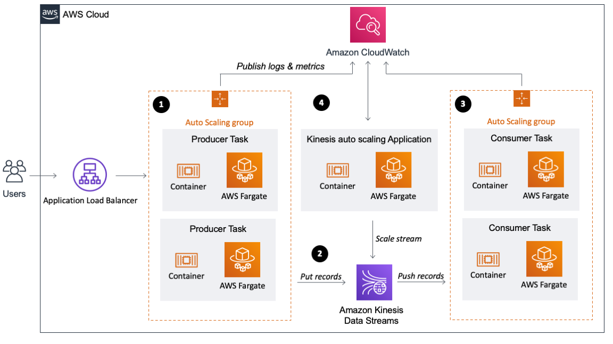
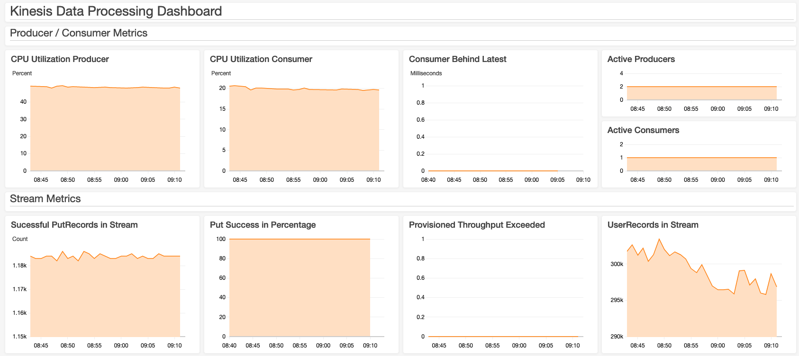

# Building a scalable streaming data processor with Amazon Kinesis Data Streams on AWS Fargate

*Florian Mair, Solutions Architect*

Data is ubiquitous in businesses today, and the volume and speed of
incoming data are constantly increasing. To derive insights from data,
it's essential to deliver it to a data lake or a data store and analyze
it. Real-time or near-real-time data delivery can be cost prohibitive,
therefore an efficient architecture is key for processing, and becomes
more essential with growing data volume and velocity.

In this post, we show you how to build a scalable producer and consumer
application for [Amazon Kinesis Data
Streams](https://docs.aws.amazon.com/streams/latest/dev/introduction.html)
running on [AWS
Fargate](https://docs.aws.amazon.com/AmazonECS/latest/developerguide/AWS_Fargate.html).
Kinesis Data Streams is a fully managed and scalable data stream that
enables you to ingest, buffer, and process data in real time. AWS
Fargate is a serverless compute engine for containers that works with
AWS container orchestration services like [Amazon Elastic Container
Service](https://docs.aws.amazon.com/AmazonECS/latest/developerguide/Welcome.html)
(Amazon ECS), which allows us to easily run, scale, and secure
containerized applications.

This solution also uses the [Amazon Kinesis Producer
Library](https://docs.aws.amazon.com/streams/latest/dev/developing-producers-with-kpl.html#developing-producers-with-kpl-role)
(KPL) and [Amazon Kinesis Client
Library](https://docs.aws.amazon.com/streams/latest/dev/shared-throughput-kcl-consumers.html#shared-throughput-kcl-consumers-overview)
(KCL) to ingest data into the stream and to process it. KPL helps you
optimize shard utilization in your data stream by specifying settings
for aggregation and batching as data is being produced into your data
stream. KCL helps you write robust and scalable consumers that can keep
up with fluctuating data volumes being sent to your data stream.

The sample code for this post is available in a [GitHub
repo](https://github.com/aws-samples/amazon-kinesis-data-processor-aws-fargate),
which also includes an [AWS
CloudFormation](http://aws.amazon.com/cloudformation) template to
get you started.

## What is data streaming?

Before we look into the details of data streaming architectures, let's
get started with a brief overview of data streaming. Streaming data is
data that is generated continuously by a large number of sources that
transmit the data records simultaneously in small packages. You can use
data streaming for many use cases, such as log processing, clickstream
analysis, device geo-location, social media data processing, and
financial trading.

A data streaming application consists of two layers: the storage layer
and the processing layer. As stream storage, AWS offers the managed
service Kinesis Data Streams, but you can also run other stream storages
like [Apache Kafka](https://kafka.apache.org/) or [Apache
Flume](https://flume.apache.org/) on [Amazon Elastic Compute
Cloud](http://aws.amazon.com/ec2) (Amazon EC2) or [Amazon
EMR](http://aws.amazon.com/emr). The processing layer consumes the
data from the storage layer and runs computations on that data. This
could be your own application that can consume data from the stream, or
you use a stream processing framework like Apache Flink, Apache Spark
Streaming, or Apache Storm. For this post, we use Kinesis Data Streams
as the storage layer and the containerized KCL application on AWS
Fargate as the processing layer.

## Streaming data processing architecture

This section gives a brief introduction to the solution's architecture,
as shown in the following diagram.

The architecture consists of four components:

-   Producer group (data ingestion)

-   Stream storage

-   Consumer group (stream processing)

-   Kinesis Data Streams auto scaling

### Data ingestion

For ingesting data into the data stream, you use the KPL, which
aggregates, compresses, and batches data records to make the ingestion
more efficient. In this architecture, the KPL increased the per-shard
throughput up to 100 times, compared to ingesting the records with the
PutRecord API (more on this in the **Monitoring your stream and
applications** section). This is because the records are smaller than 1
KB each and the example code uses the KPL to buffer and send a
collection of records in one HTTP request.

The record buffering can consume enough memory to crash itself;
therefore, we recommend handling back-pressure. A sample on handling
back-pressure is available in the KPL [GitHub
repo](https://github.com/awslabs/amazon-kinesis-producer#back-pressure).

Not every use case is suited for using the KPL for ingestion. Due to
batching and aggregation, the KPL has to buffer records, and therefore
introduces some additional per-record latency. For a large number of
small producers (such as mobile applications), you should use the
PutRecords API to batch records or implement a proxy that handles
aggregation and batching.

In this post, you set up a simple HTTP endpoint that receives data
records and processes them using the KPL. The producer application runs
in a Docker container, which is orchestrated by Amazon ECS on AWS
Fargate. A [target tracking scaling
policy](https://docs.aws.amazon.com/AmazonECS/latest/developerguide/service-autoscaling-targettracking.html)
manages the number of parallel running data ingestion containers. It
adjusts the number of running containers so you maintain an average CPU
utilization of 65%.

### Stream storage: Kinesis Data Streams

As mentioned earlier, you can run a variety of streaming platforms on
AWS. However, for the data processor in this post, you use Kinesis Data
Streams. Kinesis Data Streams is a data store where the data is held for
24 hours and configurable up to 168 hours. Kinesis Data Streams is
designed to be highly available and redundant by storing data across
three [Availability
Zones](https://docs.aws.amazon.com/AWSEC2/latest/UserGuide/using-regions-availability-zones.html#concepts-availability-zones)
in the specified Region.

The stream consists of one or more *shards*, which are uniquely
identified sequences of data records in a stream. One shard has a
maximum of 2 MB/s in reads (up to five transactions) and 1 MB/s writes
per second (up to 1,000 records per second).

Each record written to Kinesis Data Streams has a *partition key,* which
is used to group data by shard. In this example, the data stream starts
with five shards. You use random generated partition keys for the
records because records don't have to be in a specific shard. Kinesis
Data Streams assigns a *sequence number* to each data record, which is
unique within the partition key. Sequence numbers generally increase
over time so you can identify which record was written to the stream
before or after another.

### Stream processing: KCL application on AWS Fargate

This post shows you how to use custom consumers - specifically,
[enhanced fan-out
consumers](https://docs.aws.amazon.com/streams/latest/dev/enhanced-consumers.html)---using
the KCL. Enhanced fan-out consumers have a dedicated throughput of 2
MB/s and use a push model instead of pull to get data. Records are
pushed to the consumer from the Kinesis Data Streams shards using HTTP/2
Server Push, which also reduces the latency for record processing. If
you have more than one instance of a consumer, each instance has a 2
MB/s fan-out pipe to each shard independent from any other consumers.
You can use enhanced fan-out consumers with the AWS SDK or the KCL.

For the producer application, this example uses the KPL, which
aggregates and batches records. For the consumer to be able to process
these records, the application needs to deaggregate the records. To do
this, you can use the KCL or the [Kinesis Producer Library
Deaggeragtion Modules for AWS
Lambda](https://github.com/awslabs/kinesis-aggregation) (support
for Java, Node.js, Python, and Go). The KCL is a Java library but also
supports other languages via a MultiLangDaemon. The MultiLangDaemon uses
STDIN and STDOUT to communicate with the record processor, so be aware
of logging limitations. For this sample application, you use enhanced
fan-out consumers with the KCL for Python 2.0.1.

Due to the STDOUT limitation, the record processor logs data records to
a file that is written to the container logs and published to [Amazon
CloudWatch](http://aws.amazon.com/cloudwatch). If you create your
own record processor, make sure it handles exceptions, otherwise records
may be skipped.

The KCL creates an [Amazon
DynamoDB](http://aws.amazon.com/dynamodb) table to keep track of
consumer progress. For example, if your stream has four shards and you
have one producer instance, your instance runs a separate record
processor for each shard. If the consumer scales to two instances, the
KCL rebalances the record processor and runs two record processors on
each instance. For more information, see [Using the Kinesis Client
Library](https://docs.aws.amazon.com/streams/latest/dev/shared-throughput-kcl-consumers.html#shared-throughput-kcl-consumers-leasetable).

A [target tracking scaling
policy](https://docs.aws.amazon.com/AmazonECS/latest/developerguide/service-autoscaling-targettracking.html)
manages the number of parallel running data processor containers. It
adjusts the number of running containers to maintain an average CPU
utilization of 65%.

#### Container configuration

The base layer of the container is Amazon Linux 2 with Python 3 and Java
8. Although you use KCL for Python, you need Java because the record
processor communicates with the MultiLangDaemon of the KCL.

During the Docker image build, the Python library for the KCL (version
2.0.1 of amazon_kclpy) is installed, and the sample application (release
2.0.1) from the [KCL for Python GitHub
repo](https://github.com/awslabs/amazon-kinesis-client-python) is
cloned. This allows you to use helper tools
(samples/amazon_kclpy_helper.py) so you can focus on developing the
record processor. The KCL is configured via a properties file
(record_processor.properties).

For logging, you have to distinguish between logging of the
MultiLangDaemon and the record processor. The logging configuration for
the MultiLangDaemon is specified in logback.xml, whereas the record
processor has its own logger. The record processor logs to a file and
not to STDOUT, because the MultiLangDaemon uses STDOUT for
communication, therefore the Daemon would throw an unrecognized messages
error.

Logs written to a file (app/logs/record_processor.log) are attached to
container logs by a subprocess that runs in the container entry point
script (run.sh). The starting script also runs set_properties_py, which
uses environment variables to set the AWS Region, stream name, and
application name dynamically. If you want to also change other
properties, you can extend this script.

The container gets its permissions (such as to read from Kinesis Data
Streams and write to DynamoDB) by assuming the role
ECSTaskConsumerRole01. This sample deployment uses 2 vCPU and 4 GB
memory to run the container.

### Kinesis capacity management

When changes in the rate of data flow occur, you may have to increase or
decrease the capacity. With Kinesis Data Streams, you can have one or
more *hot shards* as a result of unevenly distributed partition keys,
very similar to a hot key in a database. This means that a certain shard
receives more traffic than others, and if it's overloaded, it produces a
ProvisionedThroughputExceededException (enable detailed monitoring to
see that metric on shard level).

You need to split these hot shards to increase throughput, and merge
cold shards to increase efficiency. For this post, you use random
partition keys (and therefore random shard assignment) for the records,
so we don't dive deeper into splitting and merging specific shards.
Instead, we show how to increase and decrease throughput capacity for
the whole stream. For more information about scaling on a shard level,
see [Strategies for
Resharding](https://docs.aws.amazon.com/streams/latest/dev/kinesis-using-sdk-java-resharding-strategies.html).

You can build your own scaling application utilizing the
[UpdateShardCount](https://docs.aws.amazon.com/kinesis/latest/APIReference/API_UpdateShardCount.html),
[SplitShard](https://docs.aws.amazon.com/kinesis/latest/APIReference/API_SplitShard.html),
and
[MergeShards](https://docs.aws.amazon.com/kinesis/latest/APIReference/API_MergeShards.html)
APIs or use the custom resource scaling solution as described in [Scale
Amazon Kinesis Data Streams with AWS Application Auto
Scaling](https://aws.amazon.com/blogs/big-data/scaling-amazon-kinesis-data-streams-with-aws-application-auto-scaling/)
or [Amazon Kineis Scaling
Utils](https://github.com/awslabs/amazon-kinesis-scaling-utils).
The Application Auto Scaling is an event-driven scaling architecture
based on CloudWatch alarms, and the Scaling Utils is a Docker container
that constantly monitors your data stream. The Application Auto Scaling
manages the number of shards for scaling, whereas the Kinesis Scaling
Utils additionally handles shard keyspace allocations, hot shard
splitting, and cold shard merging. For this solution, you use the
Kinesis Scaling Utils and deploy it on Amazon ECS. You can also deploy
it on [AWS Elastic
Beanstalk](https://aws.amazon.com/elasticbeanstalk) as a container
or on an Apache Tomcat platform.

## Prerequisites

For this walkthrough, you must have an [AWS
account](https://aws.amazon.com/premiumsupport/knowledge-center/create-and-activate-aws-account/).

### Solution overview

In this post, we walk through the following steps:

1.  Deploying the CloudFormation template.

2.  Sending records to Kinesis Data Streams.

3.  Monitoring your stream and applications.

Deploying the CloudFormation template

Deploy the CloudFormation stack by choosing **Launch Stack**:

The template launches in the US East (N. Virginia) Region by default. To
launch it in a different Region, use the Region selector in the console
navigation bar. The following Regions are supported:

-   US East (Ohio)

-   US West (N. California)

-   US West (Oregon)

-   Asia Pacific (Singapore)

-   Asia Pacific (Sydney)

-   Europe (Frankfurt)

-   Europe (Ireland)

Alternatively, you can download the [CloudFormation
template](https://flomair-dataprocessor-source.s3-us-west-2.amazonaws.com/deployment.yaml)
and deploy it manually. When asked to provide an IPv4 CIDR range, enter
the CIDR range that can send records to your application. You can change
it later on by adapting the [security groups inbound
rule](https://docs.aws.amazon.com/vpc/latest/userguide/VPC_SecurityGroups.html#AddRemoveRules)
for the Application Load Balancer.

### Sending records to Kinesis Data Streams

You have several options to send records to Kinesis Data Streams. You
can do it from the CLI or any API client that can send REST requests, or
use a load testing solution like [Distributed Load Testing on
AWS](https://aws.amazon.com/solutions/distributed-load-testing-on-aws/)
or [Artillery](https://artillery.io/). With load testing,
additional charges for requests occur; as a guideline, 10,000 requests
per second for 10 minutes generate an AWS bill of less than \$5.00. To
do a POST request via curl, run the following command and replace
*ALB_ENDPOINT* with the DNS record of your Application Load Balancer.
You can find it on the CloudFormation stack's **Outputs** tab. Ensure
you have a JSON element "data". Otherwise, the application can't process
the record.

`curl --location --request POST '*<ALB_ENDPOINT>*' --header
'Content-Type: application/json' --data-raw '{"data":" This is a
testing record"}'`

Your Application Load Balancer is the entry point for your data records,
so all traffic has to pass through it. Application Load Balancers
automatically scale to the appropriate size based on traffic by adding
or removing different sized load balancer nodes.

### Monitoring your stream and applications

The CloudFormation template creates a CloudWatch dashboard. You can find
it on the CloudWatch console or by choosing the link on the stack's
**Outputs** tab on the CloudFormation console. The following screenshot
shows the dashboard.

This dashboard shows metrics for the producer, consumer, and stream. The
metric **Consumer Behind Latest** gives you the offset between current
time and when the last record was written to the stream. An increase in
this metric means that your consumer application can't keep up with the
rate records are ingested. For more information, see [Consumer Record
Processing Falling
Behind](https://docs.aws.amazon.com/streams/latest/dev/troubleshooting-consumers.html#record-processing-falls-behind).

The dashboard also shows you the average CPU utilization for the
consumer and producer applications, the number of PutRecords API calls
to ingest data into Kinesis Data Streams, and how many user records are
ingested.

Without using the KPL, you would see one PutRecord equals one user
record, but in our architecture, you should see a significantly higher
number of user records than PutRecords. The ratio between UserRecords
and PutRecords operations strongly depends on [KPL configuration
parameters](https://docs.aws.amazon.com/streams/latest/dev/kinesis-kpl-config.html).
For example, if you increase the value of RecordMaxBufferedTime, data
records are buffered longer at the producer, more records can be
aggregated, but the latency for ingestion is increased.

All three applications (including the Kinesis Data Streams scaler)
publish logs to their respective log group (for example,
ecs/kinesis-data-processor-producer) in CloudWatch. You can either check
the CloudWatch logs of the Auto Scaling Application or the data stream
metrics to see the scaling behavior of Kinesis Data Streams.

### Cleaning up

To avoid additional cost, ensure that the provisioned resources are
decommissioned. To do that, delete the images in the [Amazon Elastic
Container Registry](http://aws.amazon.com/ecr/) (Amazon ECR)
repository, the CloudFormation stack, and any remaining resources that
the CloudFormation stack didn't automatically delete. Additionally,
delete the DynamoDB table DataProcessorConsumer, which the KCL created.

## Conclusion

In this post, you saw how to run the KCL for Python on AWS Fargate to
consume data from Kinesis Data Streams. The post also showed you how to
scale the data production layer (KPL), data storage layer (Kinesis Data
Streams), and the stream processing layer (KCL). You can build your own
data streaming solution by deploying the sample code from the [GitHub
repo](https://github.com/aws-samples/amazon-kinesis-data-processor-aws-fargate).
To get started with Kinesis Data Streams, see [Getting Started with
Amazon Kinesis Data
Streams](https://docs.aws.amazon.com/streams/latest/dev/getting-started.html).

## License

This library is licensed under the MIT-0 License. See the LICENSE file.
