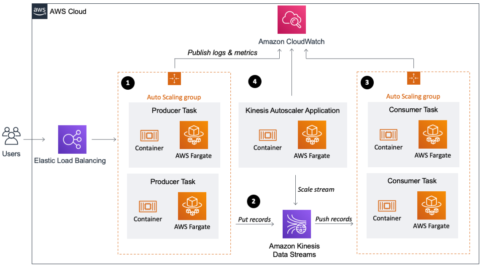
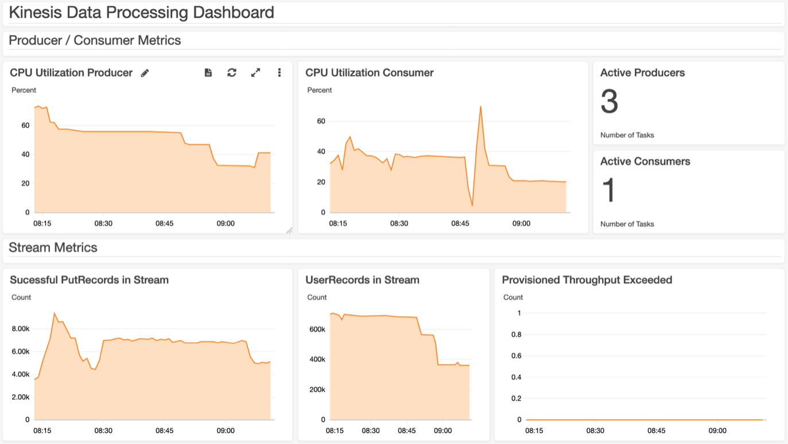

# Building a scalable streaming data processor with Amazon Kinesis on AWS Fargate
*Florian Mair, Solutions Architect*

Data is ubiquitous in businesses today, and the volume and speed of
incoming data are constantly increasing. To derive insights from data it
is essential to deliver it to a data lake or a data store and analyze
it. Real time or near-real time data delivery can be cost prohibitive,
therefore an efficient architecture is key for processing, and becomes
more essential with growing data volume and velocity.

In this blog post, you will see how to build a scalable producer and
consumer application for an [Amazon Kinesis Data Stream
(KDS)](https://docs.aws.amazon.com/streams/latest/dev/introduction.html)
running on [AWS
Fargate](https://docs.aws.amazon.com/AmazonECS/latest/developerguide/AWS_Fargate.html).
Amazon Kinesis is a fully managed and scalable data stream which enables
you to ingest, buffer and process data in real-time. AWS Fargate is a
serverless compute engine for containers that works with AWS container
orchestration services like [Amazon Elastic Container Service
(ECS)](https://docs.aws.amazon.com/AmazonECS/latest/developerguide/Welcome.html),
which allows us to easily run, scale and secure containerized
applications. Further, this example will leverage the [Kinesis Producer
Library
(KPL)](https://docs.aws.amazon.com/streams/latest/dev/developing-producers-with-kpl.html#developing-producers-with-kpl-role)
and [Kinesis Client Library
(KCL)](https://docs.aws.amazon.com/streams/latest/dev/shared-throughput-kcl-consumers.html#shared-throughput-kcl-consumers-overview)
to ingest data into the stream and to process it. KPL helps users
optimize shard utilization in their Kinesis stream by specifying
settings for aggregation and batching as data is being produced into
your Kinesis Data Stream. KCL helps you write robust and scalable
consumers that can keep up with fluctuating data volumes being sent to
your Kinesis Data Stream.

The sample code for this blog post is available in a [GitHub
repository](https://github.com/aws-samples/amazon-kinesis-data-processor-aws-fargate),
which also includes a
[CloudFormation](https://docs.aws.amazon.com/AWSCloudFormation/latest/UserGuide/Welcome.html)
template to get you started.

## What is data streaming

Before we look into the details of data streaming architectures, let's
get started with a brief overview of data streaming. Streaming data is
data that is generated continuously by a large number of sources that
transmit the data records simultaneously in small packages. Data
streaming can be used for many use cases, such as log processing,
clickstream analysis, geo-location of devices, processing of social
media data and financial trading. A data streaming application consists
of 2 layers: the storage layer and the processing layer. As stream
storage AWS offers the managed service Amazon Kinesis but you can also
run other stream storages like [Apache Kafka](https://kafka.apache.org/)
or [Apache Flume](https://flume.apache.org/) on [Amazon
EC2](https://docs.aws.amazon.com/AWSEC2/latest/UserGuide/concepts.html)
or [Amazon
EMR](https://docs.aws.amazon.com/emr/latest/ManagementGuide/emr-what-is-emr.html).
The processing layer consumes the data from the storage layer and runs
computations on that data. This could be your own application that can
consume data from the stream or you use a stream processing framework
like Apache Flink, Apache Spark Streaming or Apache Storm. In regards to
this blog post KDS will be the storage layer and the containerized KCL
application on AWS Fargate the processing layer.

## Streaming Data Processing Architecture

This chapter will give a brief introduction to the architecture shown in
this blog post.

There are 4 components in the architecture: producer group (data
ingestion), stream storage, consumer group (stream processing) and the
Kinesis auto scaler application.

### Data Ingestion

For ingesting data into the KDS, you will utilize the Kinesis Producer
Library (KPL) which aggregates, compresses, and batches data records to
make the ingestion more efficient. In this architecture, the KPL
increased the per shard throughput up to 100 times, compared to ingesting
the records with the PutRecord API (More on this in the Monitoring your
Stream and Applications section). This is due to the fact that the
records are smaller than 1KB each and the example code uses the KPL to
buffer and then send a collection of records in one HTTP request. The
record buffering can consume enough memory to crash itself, hence the
handling of back-pressure is recommended. A sample on handling
back-pressure is available in the KPL [GitHub
repo](https://github.com/awslabs/amazon-kinesis-producer#back-pressure).
Not every use-case is suited for using the KPL for ingestion. Due to
batching and aggregation, the KPL has to buffer records and therefore
introduces some additional per-record latency. For a large number of
small producers (e.g. Mobile Applications) you should use the PutRecords
API to batch records or implement a proxy that handles aggregation and
batching. In this blog post, you will set up a simple HTTP endpoint
which will receive data records and then process them using the KPL. The
producer application runs in a Docker container, which is orchestrated
by Amazon ECS on AWS Fargate. The number of parallel running data
ingestion containers is managed by a [target tracking scaling
policy](https://docs.aws.amazon.com/AmazonECS/latest/developerguide/service-autoscaling-targettracking.html),
which adjusts the number of running containers so an average CPU
utilization of 65% is maintained.

### Stream Storage: Kinesis Data Streams

As mentioned earlier, you can run a variety of streaming platforms on
AWS. However, for the data processor in this blog post, you will use
Amazon Kinesis Data Streams. KDS is a data store where the data is held
for 24 hours and configurable up to 168 hours. KDS is designed to be
highly available and redundant by storing data across 3 [Availability
Zones](https://docs.aws.amazon.com/AWSEC2/latest/UserGuide/using-regions-availability-zones.html#concepts-availability-zones)
in the specified region. The stream consists of one or more shards which
are uniquely identified sequences of data records in a stream. One shard
has a maximum of 2MB/s in reads (up to 5 transactions) and 1MB/s writes
per second (up to 1000 records per second). Each record written to
Kinesis has a Partition Key, which is used to group data by shard. In
this example, the Kinesis stream will start with 5 shards. You will use
random generated partition keys for the records because there isn't a
requirement for records to be in a specific shard. KDS assigns a
Sequence Number to each data record, which is unique within the
partition key. Sequence numbers generally increase over time so you can
identify which record was written to the Stream before or after another.

### Stream Processing: KCL application on AWS Fargate

This blog post will show you how to use custom consumers, specifically,
[Enhanced Fan-Out
Consumers](https://docs.aws.amazon.com/streams/latest/dev/enhanced-consumers.html)
using the Kinesis Client Library (KCL). Enhanced Fan-Out consumers have
a dedicated throughput of 2MB/s and use a push model instead of pull to
get data. Records are pushed to the consumer from the KDS shards using
HTTP/2 Server Push, which also reduces the latency for record
processing. If you have more than one instance of a consumer, each
instance has a 2MB/s fan-out pipe to each shard independent from any
other consumers. You can use enhanced fan-out consumers with the AWS SDK
or the KCL.

For the producer application, this example uses the KPL which aggregates
and batches records. For the consumer to be able to process these
records, the application needs to de-aggregate the records. To do this,
you can use the KCL or the [Kinesis Producer Library Deaggeragtion
Modules for AWS Lambda](https://github.com/awslabs/kinesis-aggregation)
(Support for Java, Node.js, Python and Go). The KCL is a Java library
but also supports other languages via a MultiLangDaemon. The
MultiLangDaemon uses STDIN and STDOUT to communicate with the record
processor hence be aware of logging limitations. For this sample
application you will use enhanced fan-out consumers with the KCL for
Python 2.0.1. Due to the STDOUT limitation, the record processor logs
data records to a file which is written to the container logs and
published to [Amazon
CloudWatch](https://docs.aws.amazon.com/AmazonCloudWatch/latest/monitoring/WhatIsCloudWatch.html).
If you create your own record processor make sure your it handles
exceptions, otherwise records may be skipped. The KCL creates an [Amazon
DynamoDB](https://docs.aws.amazon.com/amazondynamodb/latest/developerguide/Introduction.html)
table to keep track of consumer progress. For example, if your stream
has 4 shards and you have 1 producer instance, your instance will run a
separate record processor for each shard. If the consumer scales to 2
instances, the KCL will rebalance the record processor and run 2 record
processors on each instance. For more information check out the
developer guide on [Tracking Amazon Kinesis Data Streams Application
State](https://docs.aws.amazon.com/streams/latest/dev/kinesis-record-processor-ddb.html).
The number of parallel running data processor containers is managed by a
[target tracking scaling
policy](https://docs.aws.amazon.com/AmazonECS/latest/developerguide/service-autoscaling-targettracking.html),
which adjusts the number of running containers so an average CPU
utilization of 65% is maintained.

#### Container configuration 

Base layer of the container is Amazon Linux 2 with Python 3 and Java 8.
Although you use KCL for Python, Java is needed as the record processor
communicates with the MultiLangDaemon of the Amazon KCL. During the
Docker image build the Python library for KCL (version 2.0.1 of
amazon_kclpy) is installed and the sample application (release 2.0.1)
from the [KCL for Python GitHub
repo](https://github.com/awslabs/amazon-kinesis-client-python) is
cloned. This allows you to make use of helper tools
(samples/amazon_kclpy_helper.py) so you can focus on the development of
the record processor. The KCL is configured via a properties file
(record_processor.properties). For logging you have to distinguish
between logging of the MultiLangDaemon and the record processor. The
logging configuration for the MultiLangDaemon is specified in
logback.xml, while the record processor has its own logger. The record
processor logs to a file and not to STDOUT, because the MulitLangDaemon
uses STDOUT for communication, hence the Daemon would through an
unrecognized messages error. Logs written to a file
(app/logs/record_processor.log) are attached to container logs by a
subprocess which is run in the container entry point script (run.sh). In
the starting script also set_properties.py is executed, which uses
environment variables to set AWS Region, stream name and application
name dynamically. If you wish to change also other properties you can
extend this script. The container gets its permissions to read from
Kinesis, write to DynamoDB etc. by assuming the ECSTaskConsumerRole01.
This sample deployment uses 2 vCPU and 4GB Memory to run the container.

### Kinesis capacity management

When changes in the rate of data flow occur, the capacity may have to be
increased or decreased. With Kinesis, you can have one or more hot
shards as a result of unevenly distributed partition keys, very similar
to a hot key in a database. This means that a certain shard receives
more traffic than others, and if it is overloaded, it produces a
ProvisionedThroughputExceededException (enable detailed monitoring to
see that metric on shard level). Such hot shards need to be split to
increase throughput, and cold shards need to be merged to increase
efficiency. In this case, you will use random partition keys (and
therefore random shard assignment) for the records so this example will
not dive deeper into splitting and merging specific shards. Instead,
this example will show increasing / decreasing throughput capacity for
the whole stream. If you need scaling on shard level you should look
into [Strategies for
Resharding](https://docs.aws.amazon.com/streams/latest/dev/kinesis-using-sdk-java-resharding-strategies.html).
You can build your own scaling application utilizing the
[UpdateShardCount](https://docs.aws.amazon.com/kinesis/latest/APIReference/API_UpdateShardCount.html),
[SplitShard](https://docs.aws.amazon.com/kinesis/latest/APIReference/API_SplitShard.html)
and
[MergeShards](https://docs.aws.amazon.com/kinesis/latest/APIReference/API_MergeShards.html)
APIs or use the custom resource scaling solution as described in
[Application Auto Scaling for Kineis Data
Streams](https://aws.amazon.com/blogs/big-data/scaling-amazon-kinesis-data-streams-with-aws-application-auto-scaling/)
or the [Amazon Kineis Scaling
Utils](https://github.com/awslabs/amazon-kinesis-scaling-utils). The
Application Auto Scaling is an event-driven scaling architecture based
on CloudWatch alarms, while the Scaling Utils is a Docker Container
which constantly monitors your data stream. While the Application Auto
Scaling manages the number of shards for scaling, the Kinesis Scaling
Utils additionally handles shard keyspace allocations, hot shard
splitting and cold shard merging. For this architecture you will use the
Kinesis Scaling Utils and deploy it on ECS. As mentioned in the
documentation you can also deploy it on Elastic Beanstalk as a Container
or on an Apache Tomcat platform.

## Set up your own infrastructure

### Prerequisites

For this walkthrough, you should have the following prerequisites

-   An [AWS
    account](https://aws.amazon.com/premiumsupport/knowledge-center/create-and-activate-aws-account/)

### Step 1: Deploy the CloudFormation Template

Deploy the CloudFormation Stack by clicking the Launch Stack Button.The
template is launched in the US East (N. Virginia) Region by default. To
launch it in a different AWS Region, use the region selector in the
console navigation bar. The following regions are supported: US East (N.
Virgina), US East (Ohio), US West (N.California), US West (Oregon), Asia
Pacific (Singapore), Asia Pacific (Sydney), Europe (Frankfurt), Europe
(Ireland).

Alternatively you can download the [CloudFormation Template
File](https://flomair-dataprocessor-source.s3-us-west-2.amazonaws.com/deployment.yaml)
and deploy it manually. When asked to provide an IPv4 CIDR Range enter
the CIDR range that should be able to send records to your application.
You can change it later on by adapting the [Security Groups Inbound
Rule](https://docs.aws.amazon.com/vpc/latest/userguide/VPC_SecurityGroups.html#AddRemoveRules)
for the Application Load Balancer.

### Step 2: Send Records to KDS

You have several options to send records to Kinesis. You can do it from
the CLI, any API Client that can send REST requests, or you can use a
load testing solution like [Distributed Load Testing on
AWS](https://aws.amazon.com/solutions/distributed-load-testing-on-aws/)
or [Artillery](https://artillery.io/). With load testing additional
charges for requests occur, as a guideline 10,000 requests per second
for 10 minutes will generate an AWS bill of less than \$5. To do a POST
request via curl run the following command and replace ALB_ENDPOINT with
the DNS record of your ALB. You can find it in the CloudFormation
stack's outputs section. Ensure you have a JSON element "*data*".
Otherwise the application will not be able to process the record.

`curl --location --request POST '<``ALB_ENDPOINT``>' --header 'Content-Type: application/json' --data-raw '{\"data\":\"
This is a testing record\"}\'`

Your ALB is the entry point for your data records, hence all traffic has
to pass through it. Load Balancers automatically scale to appropriate
size based on traffic by adding or removing different sized load
balancer nodes.

### Step 3: Monitor your Stream and Applications

With the resource creation via the CloudFormation Template a CloudWatch
Dashboard has been created. You can find this in the AWS Console within
CloudWatch or by clicking the Link in the CloudFormation Stack's output
section.

This dashboard shows metrics for producer, consumer and the stream. The
metric Consumer Behind Latest, gives you the offset between current time
and the last record was written to the stream. An increase in this
metric means that your consumer application cannot keep up with the rate
records are ingested. More on this in the [Troubleshooting Kinesis Data
Streams
Consumers](https://docs.aws.amazon.com/streams/latest/dev/troubleshooting-consumers.html#record-processing-falls-behind)
documentation. Further this dashboard shows you the average CPU
Utilization for the consumer and producer applications, the number of
PutRecords API calls to ingest data into KDS and how many user records
are ingested. Without using the KPL you would see 1 PutRecord equals 1
user record, but in our architecture, you should see a significantly
higher number of user records than PutRecords. The ratio between
UserRecords and PutRecords operations strongly depends on [KPL
configuration
parameters](https://docs.aws.amazon.com/streams/latest/dev/kinesis-kpl-config.html).
For example if you increase the value of RecordMaxBufferedTime, data
records are buffered longer at the producer, hence more records can be
aggregated, but the latency for ingestion is increased. All three
(including the Kinesis Scaler) applications publish logs to the
respective log group (e.g. ecs/kinesis-data-processor-producer) in
CloudWatch. You can either check the CloudWatch logs of the Kinesis auto
scaling application or the Kinesis Stream Metrics to see the scaling
behavior of KDS.

### Cleanup

To avoid additional cost, ensure that the provisioned resources are
decommissioned. To do that delete the images in the ECR repository, the
CloudFormation stack and any remaining resources that were not deleted
by the CloudFormation stack. Further delete the DynamoDB table
DataProcessorConsumer, which was initially created by the KCL.

## Conclusion

In this blog post you saw how to use KCL and AWS Fargate to consume data
from KDS. Further it shows you how to scale the data production layer
(KPL), data storage layer (KDS) and the stream processing layer (KCL).

## License

This library is licensed under the MIT-0 License. See the LICENSE file.
