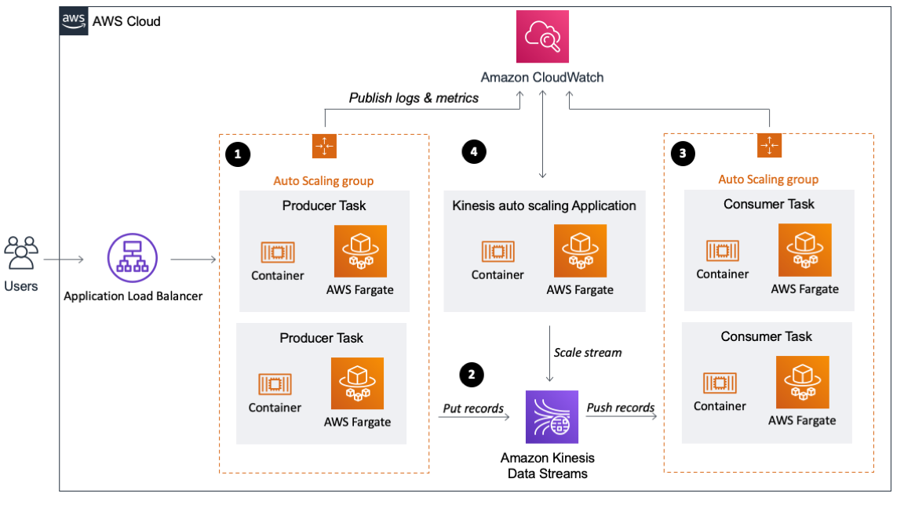

Building a scalable streaming data processor with Amazon Kinesis on AWS Fargate
=========================================================================

*Florian Mair, Solutions Architect*

# Architectural Overview

There are 4 components in the architecture:

1. Producer group (data ingestion)
2. Stream
3. Consumer group (data processor)
4. Kinesis Autoscaler Application



For more details of the individual components please refer to associated Blog Post on the [AWS Big Data Blog](https://aws.amazon.com/blogs/big-data/).

# Deployment Guide

## Step 1: Prequisites

For this walkthrough, you need the following prerequisites: 
* An AWS account

## Step 2: Deploy the CloudFormation Stack

Deploy the CloudFormation Stack by clicking the Launch Stack Button.The template is launched in the US East (N. Virginia) Region by default. To launch it in a different AWS Region, use the region selector in the console navigation bar. The following regions are supported: US East (N. Virgina), US East (Ohio), US West (N.California), US West (Oregon), Asia Pacific (Singapore), Asia Pacific (Sydney), Europe (Frankfurt), Europe (Ireland).

[](https://console.aws.amazon.com/cloudformation/home?region=us-east-1#/stacks/new?&templateURL=https://flomair-dataprocessor-source.s3-us-west-2.amazonaws.com/deployment.yaml)

Alternatively you can download the [CloudFormation Template File](https://flomair-dataprocessor-source.s3-us-west-2.amazonaws.com/deployment.yaml) and deploy it manually. When asked to provide an IPv4 CIDR Range enter the CIDR range that will be able to send records to your application. You can change that also later on by the [Security Groups Inbound Rule](https://docs.aws.amazon.com/vpc/latest/userguide/VPC_SecurityGroups.html#AddRemoveRules) of the Application Load Balancer.

### Step 2: Send Records to Kinesis

You have several options to send records to Kinesis. You can do it from the CLI, with a third-party tool like [Postman](https://www.postman.com/) or use can use a load testing solution like [Distributed Load Testing on AWS](https://aws.amazon.com/solutions/distributed-load-testing-on-aws/) or [Artillery](https://artillery.io/). With load testing additional charges for requests occur, as a guideline 10,000 requests per second for 10 minutes will generate an AWS bill of less than 5$. To do a POST request via the cli run the following command and __Replace ALB-DNS-record__ with the DNS record of your ALB. You can find it in the CloudFormation stack's outputs section. __Ensure the payload has a JSON element *data*__. Otherwise the application will not able to process the record.

```bash
curl --location --request POST 'http://ALB-DNS-record' --header 'Content-Type: application/json' --data-raw '{"data":"2000-00-00 00:00:00 INFO HelloExample:1 - This is our load testing record"}
```

### Step 3: Monitor your Stream and Applications

With the resource creation via the CloudFormation Template a CloudWatch Dashboard has been created. You can find this in the AWS Console within CloudWatch or by clicking the Link in the CloudFormation Stack's output section.


### Cleanup

To avoid additional cost, ensure that the provisioned resources are decommissioned. To do that delete the images in the ECR repository, the CloudFormation stack and any remaining resources that were not deleted by the CloudFormation stack.
